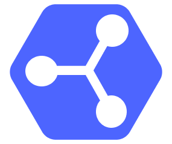

# Solid Share

<p align="center">
  
</p>

**Solid Share** is an open-source Android application that brings the [Solid](https://solidproject.org/) ecosystem to everyday mobile users. It lets people use their Solid pods as a personal data wallet — logging in with multiple accounts, browsing and managing files, and sharing data — all from their Android phone, without needing any technical background.

The goal is to make Solid accessible to regular people: a smooth, familiar mobile experience that puts users in control of their own data.

## Features

### v0.3.0 - Current

**Profile**

- **Share your profile** — present a QR code of your WebID, or copy, save, and share a link, so
  others can find and add you
- **Edit your profile** — update your display name and details and write them back to your pod
- **View public profiles** — open someone else's public Solid profile from a scanned or shared WebID

**Sharing**

- **Share files & folders** — grant a specific Solid user (by WebID) or the public (anyone with the
  link) access to any file or folder in your pod, choosing the access level
- **QR codes & share links** — every share produces a branded QR code and a copyable link; tapping a
  link opens the app directly through verified HTTPS App Links
- **Shared by me / Shared with me** — two pod-backed lists of everything you've shared and
  everything
  shared with you, including when each was shared
- **Unified scan & confirm** — one camera scanner auto-detects a share link versus a profile,
  verifies your access, and lets you pick which logged-in account receives the share
- **Duplicate as a private copy** — duplicate a file or folder, resetting the copy to owner-only
  access

**Access grants**

- **View / Add / Edit access levels** — clear, icon-labeled access modes instead of raw
  Read/Append/Write
- **Manage access** — widen, narrow, or revoke any share inline; the recipient is notified when
  their
  access changes
- **Request access** — when a shared resource denies access, ask its owner for the level you need,
  and owners can accept or decline the request
- **Cross-server access control** — Web Access Control by default with an Access Control Policy
  fallback, so grants work across major Solid servers (including Inrupt ESS)
- **Share notifications** — an in-app inbox surfaces share offers, accepts, access-level updates,
  and
  access requests, kept current by a background polling worker

### v0.2.0

- **Pod file browser** — browse containers and resources in your Solid pod with list or grid layout
- **File download & open** — download resources to your device and open them with any compatible app
- **File upload** — upload files from your device storage directly to a pod container
- **Camera capture & upload** — take a photo or video with your camera and upload it immediately to
  your pod
- **File deletion** — delete resources from your pod with a confirmation prompt
- **Sorting** — sort resources by name, type, or date in the container view
- **Background transfers** — uploads and downloads run as background workers with progress
  notifications
- **In-flight resource caching** — resources are cached as they load to improve responsiveness

### v0.1.0

- **Onboarding flow** — introduces new users to Solid and how the app works
- **Login with multiple pod providers** — Inrupt, Solid Community, Data Pod, or any custom OIDC issuer URL
- **Multi-account support** — log into multiple Solid pods and switch between them
- **Re-login with previous WebIDs** — previously logged-in accounts are remembered for quick re-authentication
- **Profile & account management** — view active account, switch accounts, log out individually or all at once

### Planned

- Sync Solid data modules (e.g. Contacts) with the Android ecosystem
- Store and use travel tickets and passes from pods
- Offline-first access for convenience

## Architecture

The app follows **Clean Architecture** with **MVVM**, organized in a single `app` module:

```
presentation/  -->  domain/model/  -->  data/repo/  -->  data/local/
(Composables        (plain data        (Repository      (DataStore /
 + ViewModels)       classes)           interfaces       Authenticator)
                                        + impls)
```

- **UI**: Jetpack Compose with Material 3
- **Navigation**: Type-safe Compose Navigation with serializable routes
- **Dependency injection**: Hilt
- **Local storage**: DataStore Preferences
- **Solid communication**: [Android Solid Services (solidandroidapi)](https://github.com/pondersource/Android-Solid-Services)
- **Authentication**: OpenID Connect via AppAuth, delegated through `AuthRepository`

## Tech Stack

| Component              | Version          |
|------------------------|------------------|
| Kotlin                 | 2.3.21           |
| Android Gradle Plugin  | 9.2.1            |
| KSP                    | 2.3.5            |
| Jetpack Compose BOM    | 2026.04.01       |
| Hilt                   | 2.59.2           |
| Navigation Compose     | 2.9.8            |
| WorkManager            | 2.11.2           |
| Android Solid Services | 0.5.1            |
| Min SDK                | 26 (Android 8.0) |
| Target SDK             | 35               |
| Compile SDK            | 37               |
| JVM Toolchain          | 17               |

## Getting Started

### Prerequisites

- Android Studio (latest stable)
- JDK 17
- An Android device or emulator running Android 8.0+
- A Solid pod account (you can create one at [Inrupt](https://login.inrupt.com) or [solidcommunity.net](https://solidcommunity.net))

### Build & Run

```bash
# Clone the repository
git clone https://github.com/erfangholami/SolidShare.git
cd SolidShare

# Build debug APK
./gradlew assembleDebug

# Install on a connected device
./gradlew installDebug
```

### Release Build

Release builds require signing environment variables:

| Variable            | Description update               |
|---------------------|----------------------------------|
| `KEYSTORE_PATH`     | Path to the `.jks` keystore file |
| `KEYSTORE_PASSWORD` | Keystore password                |
| `KEY_ALIAS`         | Key alias inside the keystore    |
| `KEY_PASSWORD`      | Key password                     |

```bash
./gradlew assembleRelease
```

A GitHub Actions workflow automatically builds and publishes a release APK when changes are pushed to `master` with a tag.

## Project Structure

```
app/src/main/java/com/erfangholami/solidshare/
├── data/
│   ├── local/                # DataStore-backed local data sources
│   │   ├── auth/             # Active WebID, logged-in / logged-out accounts
│   │   └── settings/         # App preferences & one-shot flags
│   └── repo/                 # Repository interfaces & implementations
│       ├── auth/             # Login, multi-account, active WebID (wraps the library Authenticator)
│       ├── file/             # Browse, upload, download, delete, access probing
│       ├── sharing/          # Create / manage / revoke shares, given & received indexes
│       ├── notifications/    # Inbox notifications + unread-badge store
│       ├── profile/          # Public-profile reads
│       └── settings/         # App settings
├── di/                       # Hilt modules (Repository, DataSource, SolidApi, Application, Local)
├── domain/
│   └── model/                # Domain models (PodServer, ContainerItem, Sharing, PublicProfile, …)
├── notification/             # NotificationHelper for system-tray notifications
├── presentation/
│   ├── components/           # Reusable UI (AccountSwitcher, ResourceActionsSheet, NotificationBell, …)
│   ├── container/            # Container (folder) browser & ViewModel
│   ├── login/                # Login screen & ViewModel
│   ├── main/                 # Bottom-nav host & tabs (Home, Files, Share, Profile, Edit Profile)
│   ├── navigation/           # Navigation graph & typed routes
│   ├── notifications/        # Notifications hub (All / Unread / Requests)
│   ├── onboard/              # Onboarding flow
│   ├── permissions/          # Runtime permission gate
│   ├── sharing/              # Share, scan, confirm-access, manage-access & profile-share screens
│   ├── startup/              # Startup auth-check screen
│   ├── theme/                # Material 3 theme, colors, typography
│   ├── util/                 # Avatar colors, clipboard & QR-code helpers
│   ├── MainActivity.kt
│   └── MainViewModel.kt      # Deep-link handling
├── util/                     # DateUtils, MediaUtils, StringProvider
├── worker/                   # DownloadWorker, UploadWorker, NotificationPollingWorker
└── SolidShareApplication.kt  # Application + WorkManager configuration
```

## Dependencies

Core Solid communication is provided by
the [Android Solid Services](https://github.com/pondersource/Android-Solid-Services)
library (`com.erfangholami.androidsolidservices:api`, plus its transitive `shared` artifact) — it
handles authentication, resource management, sharing (WAC/ACP grants and the on-pod given/received
indexes), and inbox notifications. Until these artifacts are published to Maven Central they are
consumed from the local Maven cache (`~/.m2`), so `settings.gradle.kts` lists `mavenLocal()` first.

The app's other notable dependencies:

- **UI** — Jetpack Compose (BOM), Material 3, Material Icons Extended, Compose UI Tooling, Google
  Fonts
- **Dependency injection** — Hilt, with the Hilt Navigation Compose and Hilt Work integrations
- **Navigation** — Navigation Compose (type-safe serializable routes)
- **Background work** — WorkManager (upload, download, and notification-polling workers)
- **Local storage** — DataStore (Preferences)
- **Lifecycle** — Lifecycle ViewModel KTX and Lifecycle Runtime Compose
- **Async & serialization** — Kotlin Coroutines and Kotlinx Serialization (JSON)
- **QR generation** — ZXing Core (renders branded share / profile QR codes)
- **QR scanning** — CameraX (Camera2, Lifecycle, View) for the camera preview, and ML Kit Barcode
  Scanning for decoding from camera frames and gallery images

All versions are pinned in the `gradle/libs.versions.toml` version catalog.

## Contributing

Contributions are welcome! The project is open source under the MIT License.

1. Fork the repository
2. Create a feature branch
3. Make your changes
4. Run `./gradlew compileDebugKotlin` to verify compilation
5. Submit a pull request

## License

This project is licensed under the **MIT License** — see the [LICENSE](LICENSE) file for details.

## Acknowledgments

This project is funded by [NLnet](https://nlnet.nl/) as part of [Mobifree](https://mobifree.org/).

<p align="center">
  <a href="https://nlnet.nl/"></a>
  &nbsp;&nbsp;&nbsp;
  <a href="https://mobifree.org/"></a>
</p>
