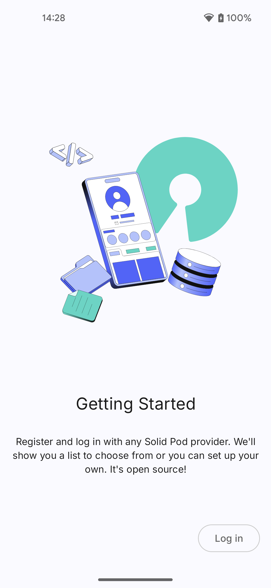
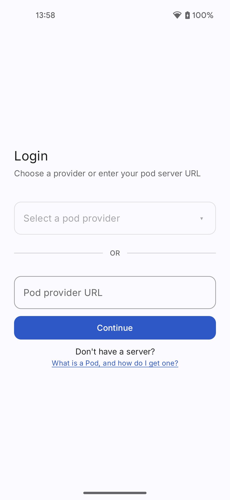
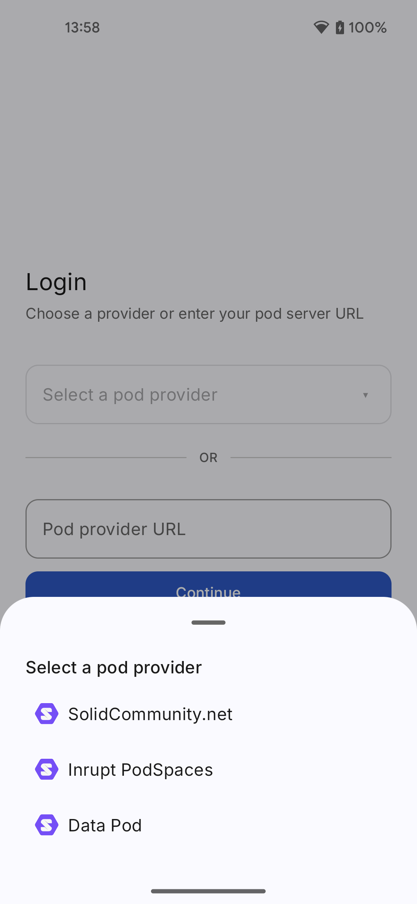
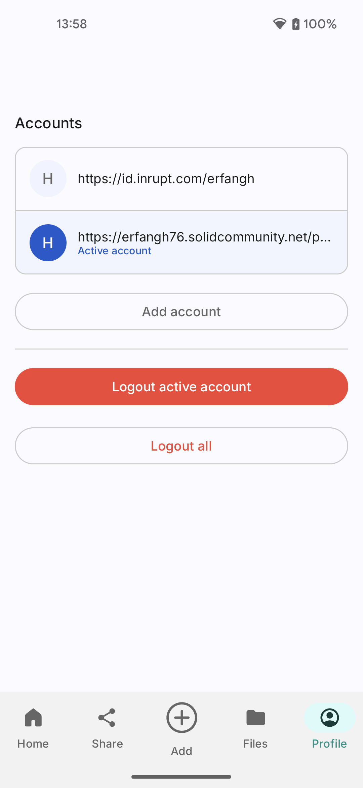
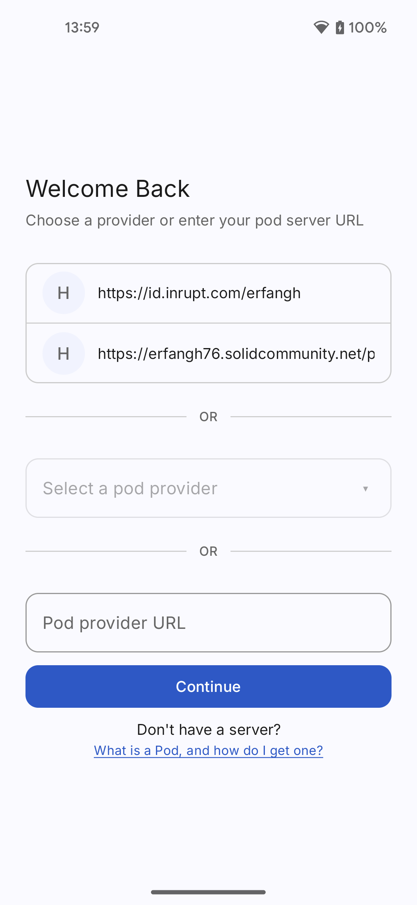

# Solid Share

<p align="center">
  
</p>

**Solid Share** is an open-source Android application that brings the [Solid](https://solidproject.org/) ecosystem to everyday mobile users. It lets people use their Solid pods as a personal data wallet — logging in with multiple accounts, browsing and managing files, and sharing data — all from their Android phone, without needing any technical background.

The goal is to make Solid accessible to regular people: a smooth, familiar mobile experience that puts users in control of their own data.

## Screenshots

<p align="center">
    
    &nbsp;
    
    &nbsp;
    
    &nbsp;
     
    &nbsp;
    
</p>


## Features

### Current (v0.1.0)

- **Onboarding flow** — introduces new users to Solid and how the app works
- **Login with multiple pod providers** — Inrupt, Solid Community, Data Pod, or any custom OIDC issuer URL
- **Multi-account support** — log into multiple Solid pods and switch between them
- **Re-login with previous WebIDs** — previously logged-in accounts are remembered for quick re-authentication
- **Profile & account management** — view active account, switch accounts, log out individually or all at once

### Planned

- Browse, upload, edit, and delete files on Solid pods
- Share private files via QR code or generated link
- Sync Solid data modules (e.g. Contacts) with the Android ecosystem
- Store and use travel tickets and passes from pods
- Offline-first access for convenience

## Architecture

The app follows **Clean Architecture** with **MVVM**, organized in a single `app` module:

```
presentation/  -->  domain/model/  -->  data/repo/  -->  data/local/
(Composables        (plain data        (Repository      (DataStore /
 + ViewModels)       classes)           interfaces       Authenticator)
                                        + impls)
```

- **UI**: Jetpack Compose with Material 3
- **Navigation**: Type-safe Compose Navigation with serializable routes
- **Dependency injection**: Hilt
- **Local storage**: DataStore Preferences
- **Solid communication**: [Android Solid Services (solidandroidapi)](https://github.com/pondersource/Android-Solid-Services)
- **Authentication**: OpenID Connect via AppAuth, delegated through `AuthRepository`

## Tech Stack

| Component | Version |
|---|---|
| Kotlin | 2.3.20 |
| Android Gradle Plugin | 9.1.0 |
| Jetpack Compose BOM | 2026.03.01 |
| Hilt | 2.59.2 |
| Min SDK | 26 (Android 8.0) |
| Target SDK | 35 |
| Compile SDK | 37 |
| JVM Toolchain | 17 |

## Getting Started

### Prerequisites

- Android Studio (latest stable)
- JDK 17
- An Android device or emulator running Android 8.0+
- A Solid pod account (you can create one at [Inrupt](https://login.inrupt.com) or [solidcommunity.net](https://solidcommunity.net))

### Build & Run

```bash
# Clone the repository
git clone https://github.com/nicoss01/Solid-Share.git
cd Solid-Share

# Build debug APK
./gradlew assembleDebug

# Install on a connected device
./gradlew installDebug
```

### Release Build

Release builds require signing environment variables:

| Variable | Description |
|---|---|
| `KEYSTORE_PATH` | Path to the `.jks` keystore file |
| `KEYSTORE_PASSWORD` | Keystore password |
| `KEY_ALIAS` | Key alias inside the keystore |
| `KEY_PASSWORD` | Key password |

```bash
./gradlew assembleRelease
```

A GitHub Actions workflow automatically builds and publishes a release APK when changes are pushed to `master`.

## Project Structure

```
app/src/main/java/com/erfangholami/solidshare/
├── data/
│   ├── local/          # DataStore & Authenticator implementations
│   └── repo/           # Repository interfaces & implementations
├── di/                 # Hilt dependency injection modules
├── domain/
│   └── model/          # Domain models (PodServer, LoggedInUser, etc.)
├── presentation/
│   ├── login/          # Login screen & ViewModel
│   ├── main/           # Main screens (Home, Share, Add, Files, Profile)
│   ├── navigation/     # Navigation graph & route definitions
│   ├── onboard/        # Onboarding flow
│   ├── startup/        # Startup auth-check screen
│   ├── theme/          # Material 3 theme, colors, typography
│   └── MainActivity.kt
└── SolidShareApplication.kt
```

## Dependencies

This app uses the [Android Solid Services](https://github.com/pondersource/Android-Solid-Services) library (`solidandroidapi`) for communicating with Solid pods. Since this library is not yet published to Maven Central, the AAR is included locally under `local-maven/` with a standard Maven repository layout.

## Contributing

Contributions are welcome! The project is open source under the MIT License.

1. Fork the repository
2. Create a feature branch
3. Make your changes
4. Run `./gradlew compileDebugKotlin` to verify compilation
5. Submit a pull request

## License

This project is licensed under the **MIT License** — see the [LICENSE](LICENSE) file for details.

## Acknowledgments

This project is funded by [NLnet](https://nlnet.nl/) as part of [Mobifree](https://mobifree.org/).

<p align="center">
  <a href="https://nlnet.nl/"></a>
  &nbsp;&nbsp;&nbsp;
  <a href="https://mobifree.org/"></a>
</p>
