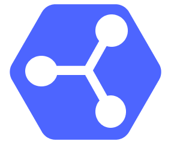

# Solid Share

<p align="center">
  
</p>

**Solid Share** is an open-source Android application that brings the [Solid](https://solidproject.org/) ecosystem to everyday mobile users. It lets people use their Solid pods as a personal data wallet — logging in with multiple accounts, browsing and managing files, and sharing data — all from their Android phone, without needing any technical background.

The goal is to make Solid accessible to regular people: a smooth, familiar mobile experience that puts users in control of their own data.


## Features

### v0.4.0 - Current

The release that turns Solid Share from a pod file browser into a pod **data** app: a wallet and an
address book of your own, everything usable offline, and sharing that understands what it is
sharing.

**Wallet — new**

- **Tickets and passes on your pod** — event tickets, boarding passes, cinema tickets, loyalty
  cards and coupons stored as ordinary Solid resources you own, registered in your type index so
  any Solid app can find them
- **Passes that look like passes** — five Apple-parity layouts (boarding, coupon, event, store
  card, generic) with the issuer's own colours and artwork, a tear-line barcode panel, and a
  faded treatment once a pass has expired
- **Apple Wallet import, with nothing dropped** — a `.pkpass` or a `.pkpasses` bundle is read in
  full: pass identity, all seven field tiers, reservation, membership and Wi-Fi details, locations
  and beacons, relevancy dates and voided state. The original file is kept on the pod beside the
  ticket
- **Barcodes re-rendered byte-faithfully** in the symbology the issuer used, so gate scanners read
  the identical code, with a screen-brightness boost when you open one
- **Boarding passes understood** — IATA boarding-pass barcodes are decoded for the details Apple
  leaves inside the token
- **Journeys** — transport mode, from and to, departure and arrival for flights, trains, buses and
  boats, editable on the ticket, and travel tickets sorted by departure time
- **Issuer jargon translated** into plain, localized labels — doors, boarding, gate closes, cabin
  classes
- **Passes that stay current** — a pass carrying an issuer web service refreshes itself on wallet
  open and twice a day
- **An open ticket-QR format** — any issuer can offer one-tap add-to-pod, with no integration and
  no server of ours involved
- **Open a pass from anywhere** — a `.pkpass` shared or opened from any app lands in a preview of
  what was read, to add as-is or edit first

**Contacts — new**

- **Your address book on your pod**, in the standard vCard vocabulary, registered in the type index
  and round-tripped in full, so nothing another app wrote is lost when Solid Share writes back
- **Two-way sync with the phone's Contacts app** — one Android account per pod, contacts appear
  everywhere on the device, and editing or deleting them in any app pushes back to the pod
- **Bring contacts in** — import the phone's own contacts from any account, or a `.vcf` file
- **Take them out** — export everything as vCard
- **Duplicate review** — near-duplicates are suggested and merged only when you say so, never
  silently
- **Address books** — create private or public books, rename and delete them
- **Contacts in sharing** — pick a share receiver from your address book instead of pasting a WebID

**Sharing data, not just files**

- **Share a ticket or a contact as a thing** — the receiver is told "Alice shared a ticket with
  you", sees a real pass or contact card, and can add it to their own wallet or address book,
  owning their copy
- **A public pass link** — publish a single pass by link, revocable with a switch
- **Send a copy of a file to another app** from the file actions sheet
- **Open a shared resource's container** straight from the Share tab

**Offline-first**

- **Everything you have seen is on the device**, in an encrypted database, and opens with no
  connection
- **Every write queues** — upload, delete, create a folder, duplicate, add or edit a ticket or
  contact — and drains by itself when the connection comes back
- **Make available offline** — pin a file so its content is always there
- **One clear affordance** on the few surfaces that genuinely need a connection, instead of
  buttons that fail
- **Long jobs run in the background** — contacts import and export survive leaving the app, and
  report progress in the notification shade

**Accounts and notifications**

- **An expired session is a state, not a logout** — the account stays on your Profile page and
  reconnects in one tap, keeping its device contacts until you actually sign out
- **Notifications per account**, so switching accounts switches what you see
- **Notifications that look like Solid Share** — the app's own mark in the status bar, and file
  transfers branded to match

**Under the hood**

- **Two distributions** — a Play build with crash reporting, and a fully free-software build with
  no proprietary dependency linked at all (F-Droid ready)
- **Barcode decoding by zxing-cpp** instead of ML Kit, so both builds scan identically and neither
  ships a proprietary blob
- **Error messages written for people**, produced by one layer instead of by each screen
- **A smoother app** — barcode rendering, pass parsing and file decryption moved off the main
  thread
- **Data modules register themselves**, so a future kind of data plugs in without editing the home
  screen, navigation or scanner
- **Layering enforced by tests** with shrink-only baselines, so the structure cannot quietly rot
- **The tag is the version** — nothing writes it down, so a release can't disagree with itself, and
  pushing a tag cuts the release
- **Built against AndroidSolidServices 0.7.0** from Maven Central, so a clean checkout builds
- **A documentation page per feature**, in a reading order — see below

### v0.3.0

**Profile**

- **Share your profile** — present a QR code of your WebID, or copy, save, and share a link, so
  others can find and add you
- **Edit your profile** — update your display name and details and write them back to your pod
- **View public profiles** — open someone else's public Solid profile from a scanned or shared WebID

**Sharing**

- **Share files & folders** — grant a specific Solid user (by WebID) or the public (anyone with the
  link) access to any file or folder in your pod, choosing the access level
- **QR codes & share links** — every share produces a branded QR code and a copyable link; tapping a
  link opens the app directly through verified HTTPS App Links
- **Shared by me / Shared with me** — two pod-backed lists of everything you've shared and
  everything
  shared with you, including when each was shared
- **Unified scan & confirm** — one camera scanner auto-detects a share link versus a profile,
  verifies your access, and lets you pick which logged-in account receives the share
- **Duplicate as a private copy** — duplicate a file or folder, resetting the copy to owner-only
  access

**Access grants**

- **View / Add / Edit access levels** — clear, icon-labeled access modes instead of raw
  Read/Append/Write
- **Manage access** — widen, narrow, or revoke any share inline; the recipient is notified when
  their
  access changes
- **Request access** — when a shared resource denies access, ask its owner for the level you need,
  and owners can accept or decline the request
- **Cross-server access control** — Web Access Control by default with an Access Control Policy
  fallback, so grants work across major Solid servers (including Inrupt ESS)
- **Share notifications** — an in-app inbox surfaces share offers, accepts, access-level updates,
  and
  access requests, kept current by a background polling worker

### v0.2.0

- **Pod file browser** — browse containers and resources in your Solid pod with list or grid layout
- **File download & open** — download resources to your device and open them with any compatible app
- **File upload** — upload files from your device storage directly to a pod container
- **Camera capture & upload** — take a photo or video with your camera and upload it immediately to
  your pod
- **File deletion** — delete resources from your pod with a confirmation prompt
- **Sorting** — sort resources by name, type, or date in the container view
- **Background transfers** — uploads and downloads run as background workers with progress
  notifications
- **In-flight resource caching** — resources are cached as they load to improve responsiveness

### v0.1.0

- **Onboarding flow** — introduces new users to Solid and how the app works
- **Login with multiple pod providers** — Inrupt, Solid Community, Data Pod, or any custom OIDC issuer URL
- **Multi-account support** — log into multiple Solid pods and switch between them
- **Re-login with previous WebIDs** — previously logged-in accounts are remembered for quick re-authentication
- **Profile & account management** — view active account, switch accounts, log out individually or all at once

### Planned

- Reproducible F-Droid builds
- More data modules on the same framework

## Documentation

Every feature above has a page under [`documents/`](documents/README.md) explaining how it actually
works — its shape on the pod, its screens, what it does when the network or the server misbehaves,
and the seams a future change is expected to use. If you want more detail on how any one of these
is handled, **open its page**; they are written for whoever has to change the code next.

**Read them in this order.** The first four are the layers every feature sits on; after that, any
page stands alone.

| # | Page | Read it for |
|---|---|---|
| 1 | [Architecture](documents/ARCHITECTURE.md) | The layers and what may depend on what, dependency injection, the library boundary, and which rules a failing build enforces rather than a reviewer |
| 2 | [Authentication & accounts](documents/AUTH.md) | Signing in to a pod, holding several identities at once, why everything is scoped to the active WebID, and expiry as a state rather than a crash |
| 3 | [Offline-first](documents/OFFLINE.md) | The encrypted cache and the two write queues everything goes through, what works with no connection, and what deliberately refuses |
| 4 | [Errors](documents/ERRORS.md) | How a failure becomes a sentence a person can act on instead of a status code, from one layer instead of from each screen |
| 5 | [Files](documents/FILES.md) | The pod file browser, its queue, and the decisions behind rename-as-copy and non-recursive container sizes |
| 6 | [Sharing](documents/share.md) | View/Add/Edit as WAC and ACP grants, the on-pod given and received indexes, links and QR codes, and inbox delivery |
| 7 | [Entity sharing](documents/ENTITY_SHARING.md) | Sharing *a ticket* or *a contact* rather than a file, and the contract a data module implements to join in |
| 8 | [Notifications](documents/NOTIFICATIONS.md) | The bell hub over your pod's LDN inbox, typed rows, and why polling beat a live socket |
| 9 | [Contacts](documents/CONTACTS.md) | The address book on your pod, the two-way mirror into the phone's Contacts app, and duplicate review |
| 10 | [Wallet (tickets)](documents/TICKETS.md) | Passes as pod resources, the open ticket-QR format any issuer can adopt, `.pkpass` import, and issuer refresh |
| 11 | [Data modules](documents/DATA_MODULES.md) | The framework the last two are built on, and what adding a third actually costs |
| 12 | [Ticket vocabulary](documents/TICKET_VOCAB.md) | The normative term dictionary for a ticket on a pod, and why each minted term exists |
| 13 | [Testing](documents/TESTING.md) | What the suite pins, how to run it, and the gotchas that cost an afternoon each |
| 14 | [Publishing](documents/PUBLISHING.md) | Shipping to Google Play and F-Droid, and the version-from-source rule behind it |

The full index — including the original sharing R&D standard and the modularization record — is in
[documents/README.md](documents/README.md). The library that talks to the pod documents itself
separately, at [androidsolidservices.erfangholami.com](https://androidsolidservices.erfangholami.com).

## Architecture

The app follows **Clean Architecture** with **MVVM**, organized in a single `app` module:

```
presentation/  -->  domain/model/  -->  data/repo/  -->  data/local/
(Composables        (plain data        (Repository      (DataStore /
 + ViewModels)       classes)           interfaces       Room /
                                        + impls)         Authenticator)
```

- **UI**: Jetpack Compose with Material 3
- **Navigation**: Type-safe Compose Navigation with serializable routes
- **Dependency injection**: Hilt
- **Local storage**: DataStore Preferences for settings, and an SQLCipher-encrypted Room database
  for the offline cache and the write queues
- **Background work**: WorkManager (uploads, downloads, queue drains, inbox polling, contacts
  import/export, pass refresh)
- **Solid communication**: [Android Solid Services](https://github.com/erfangholami/Android-Solid-Services)
- **Authentication**: Solid-OIDC via AppAuth, delegated through `AuthRepository`

A tour of all of it is in [documents/ARCHITECTURE.md](documents/ARCHITECTURE.md).

## Tech Stack

| Component              | Version          |
|------------------------|------------------|
| Kotlin                 | 2.3.21           |
| Android Gradle Plugin  | 9.3.1            |
| KSP                    | 2.3.5            |
| Jetpack Compose BOM    | 2026.06.01       |
| Hilt                   | 2.60.1           |
| Navigation Compose     | 2.9.8            |
| WorkManager            | 2.11.2           |
| Room                   | 2.8.4            |
| SQLCipher              | 4.17.0           |
| Android Solid Services | 0.7.0            |
| Min SDK                | 26 (Android 8.0) |
| Target SDK             | 35               |
| Compile SDK            | 37               |
| JVM Toolchain          | 17               |

## Getting Started

### Prerequisites

- Android Studio (latest stable)
- JDK 17
- An Android device or emulator running Android 8.0+
- A Solid pod account (you can create one at [Inrupt](https://login.inrupt.com) or [solidcommunity.net](https://solidcommunity.net))

### Two distributions

The app builds in two flavours, along a single `distribution` dimension:

| Flavour | For | Telemetry |
|---------|-----|-----------|
| `foss`  | F-Droid and other free-software stores | none — no proprietary SDK is linked at all |
| `gms`   | Google Play | Crashlytics and Analytics |

The split is a source-set split rather than a runtime flag, so the FOSS APK contains no Firebase
classes whatsoever. Barcode decoding is free software in both builds. Building `gms` needs your own
`app/src/gms/google-services.json` (never committed); `foss` builds without one, so **start with
`foss` if you just want to run the app.**

### Build & Run

```bash
# Clone the repository
git clone https://github.com/erfangholami/SolidShare.git
cd SolidShare

# Build and install the free-software debug build
./gradlew installFossDebug

# Play-flavoured build (needs app/src/gms/google-services.json)
./gradlew installGmsDebug

# Kotlin-only compile check, and the test suite
./gradlew compileFossDebugKotlin
./gradlew testFossDebugUnitTest testGmsDebugUnitTest
```

### Release Build

Release signing is read at configuration time from a gitignored `keystore.properties` at the repo
root, which must exist for any Gradle task:

| Key                 | Content                          |
|---------------------|----------------------------------|
| `KEYSTORE_PATH`     | Path to the `.jks` keystore file |
| `KEYSTORE_PASSWORD` | Keystore password                |
| `KEY_ALIAS`         | Key alias inside the keystore    |
| `KEY_PASSWORD`      | Key password                     |

```bash
./gradlew :app:assembleFossRelease   # what F-Droid's builder reproduces
./gradlew :app:bundleGmsRelease      # the Play upload artifact
```

**The release tag is the version.** Nothing in the source declares it: the build resolves it with
`git describe` and derives `versionCode` from it, so a tag and a build can never disagree. Check
what a checkout resolves to with `./gradlew -q :app:printVersion`, and override it with
`-PappVersionName=0.4.0` when building from a source archive that carries no git metadata.

Pushing a `v` tag is therefore the whole publish step: CI builds both flavours, gates the FOSS APK
for proprietary code, and attaches the artifacts to a GitHub release. The full procedure is in
[documents/PUBLISHING.md](documents/PUBLISHING.md).

## Project Structure

```
app/src/main/java/com/erfangholami/solidshare/
├── data/
│   ├── device/               # The phone's own contacts, read for import
│   ├── local/
│   │   ├── auth/             # Active WebID, logged-in / logged-out accounts (DataStore)
│   │   ├── cache/            # Encrypted Room database: cache, blobs, and the two write queues
│   │   └── settings/         # App preferences & one-shot flags (DataStore)
│   ├── passimport/           # .pkpass, .pkpasses and boarding-pass barcode parsing
│   └── repo/                 # Repository interfaces & implementations
│       ├── auth/             # Login, multi-account, active WebID (wraps the library Authenticator)
│       ├── contacts/         # Address books, contacts, duplicate detection
│       ├── datamodule/       # The data-module lifecycle & registry
│       ├── file/             # Browse, upload, download, delete, access probing
│       ├── notifications/    # Inbox notifications + unread-badge store
│       ├── outbox/           # The write queues and their drain policy
│       ├── profile/          # Public-profile reads
│       ├── settings/         # App settings
│       ├── sharing/          # Create / manage / revoke shares, given & received indexes
│       └── tickets/          # Wallet passes, the ticket QR codec
├── di/                       # Hilt modules (Repository, DataSource, DataModule, EntityShare,
│                             #   SolidApi, Application, Local, Cache)
├── domain/
│   ├── error/                # AppError × AppOperation → the one message layer
│   └── model/                # Domain models (ContainerItem, Sharing, Ticket, Contact, …)
├── notification/             # NotificationHelper for system-tray notifications
├── presentation/
│   ├── components/           # Reusable UI (AccountSwitcher, NotificationBell, RequiresConnection…)
│   ├── contacts/             # Contacts list, detail, settings, books, merge review, sharing
│   ├── container/            # Container (folder) browser & ViewModel
│   ├── login/                # Login screen & ViewModel
│   ├── main/                 # Bottom-nav host & tabs (Home, Files, Share, Profile, Edit Profile)
│   ├── navigation/           # Navigation graph & typed routes
│   ├── notifications/        # Notifications hub (All / Unread / Requests)
│   ├── onboard/              # Onboarding flow
│   ├── permissions/          # Runtime permission gate
│   ├── sharing/              # Share, scan, confirm-access, manage-access & profile-share screens
│   ├── startup/              # Startup auth-check screen
│   ├── theme/                # Material 3 theme, colors, typography
│   ├── util/                 # Avatar colors, clipboard & QR-code helpers
│   ├── wallet/               # Wallet list, pass rendering, detail, edit, import, sharing
│   ├── MainActivity.kt
│   └── MainViewModel.kt      # Deep-link handling
├── sync/                     # Android account + contacts SyncAdapter
├── telemetry/                # Auth analytics interfaces (implemented per flavour)
├── util/                     # DateUtils, MediaUtils, StringProvider, vCard I/O, barcode rendering
├── worker/                   # Uploads, downloads, queue drains, inbox polling, contacts import /
│                             #   export, pass refresh
└── SolidShareApplication.kt  # Application + WorkManager configuration
```

## Dependencies

Core Solid communication is provided by the
[Android Solid Services](https://github.com/erfangholami/Android-Solid-Services) library
(`com.erfangholami.androidsolidservices:api`, plus its transitive `shared` artifact), resolved from
**Maven Central** — it handles authentication, resource management, sharing (WAC/ACP grants and the
on-pod given/received indexes), inbox notifications, and the contacts and tickets data modules. Its
own documentation is at
[androidsolidservices.erfangholami.com](https://androidsolidservices.erfangholami.com).

`settings.gradle.kts` lists only `google()` and `mavenCentral()`, deliberately: F-Droid and any
outside contributor build from a clean checkout, so anything available only in a local `~/.m2`
would make the app unbuildable for everyone else.

The app's other notable dependencies:

- **UI** — Jetpack Compose (BOM), Material 3, Material Icons Extended, Compose UI Tooling, Google
  Fonts
- **Dependency injection** — Hilt, with the Hilt Navigation Compose and Hilt Work integrations
- **Navigation** — Navigation Compose (type-safe serializable routes)
- **Background work** — WorkManager
- **Local storage** — DataStore (Preferences), and Room over SQLCipher for the offline cache and
  write queues
- **Lifecycle** — Lifecycle ViewModel KTX and Lifecycle Runtime Compose
- **Async & serialization** — Kotlin Coroutines and Kotlinx Serialization (JSON)
- **Barcodes** — ZXing Core to render branded QR codes and ticket barcodes, CameraX for the camera
  preview, and zxing-cpp to decode from camera frames and gallery images. All three are free
  software, so both distributions scan and render identically
- **Crash reporting and analytics** — Firebase, in the `gms` flavour only
- **Testing** — JUnit, Robolectric, mockk, kotlinx-coroutines-test

All versions are pinned in the `gradle/libs.versions.toml` version catalog.

## Contributing

Contributions are welcome! The project is open source under the MIT License.

1. Fork the repository
2. Create a feature branch
3. Read the [page for the feature you are changing](documents/README.md) — each one names the seams
   a change is expected to use, and the decisions it should not quietly reverse
4. Make your changes, and update that page if the behaviour it describes moved
5. Run `./gradlew compileFossDebugKotlin` and `./gradlew testFossDebugUnitTest testGmsDebugUnitTest`
6. Submit a pull request

## License

This project is licensed under the **MIT License** — see the [LICENSE](LICENSE) file for details.

## Acknowledgments

This project is funded by [NLnet](https://nlnet.nl/) as part of [Mobifree](https://mobifree.org/).

<p align="center">
  <a href="https://nlnet.nl/"></a>
  &nbsp;&nbsp;&nbsp;
  <a href="https://mobifree.org/"></a>
</p>
